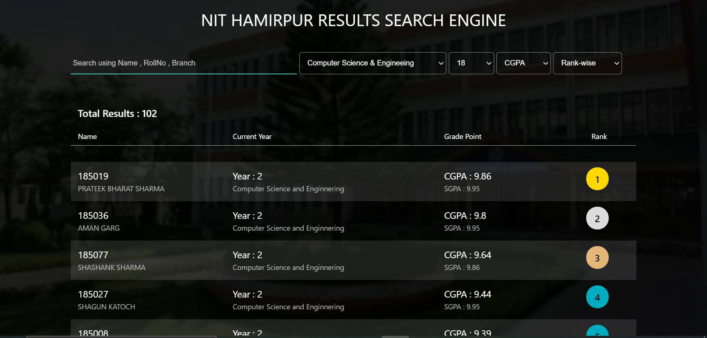
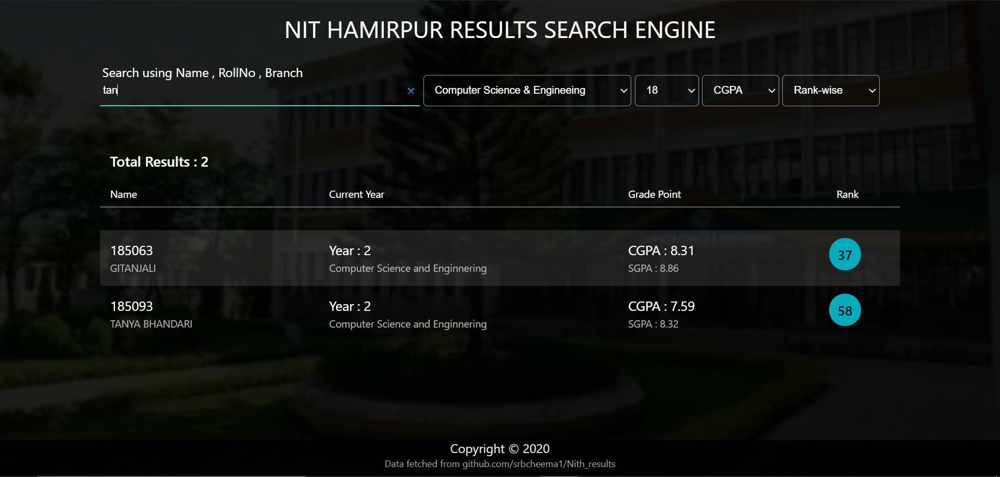

# NITH-Results
This repository contains the results details of all batches(currently studying) in NIT Hamirpur. 
Data fetched by [srbcheema1/Nith_results](https://github.com/srbcheema1/Nith_results) 

[Web interface](http://nith-results.vercel.app/)   

### Contributors
1- [Deeksha Sharma](https://github.com/Deeksha2501/) 
2- [Tanya Bhandari](https://github.com/66rhythm/) 
3- [Arpita Tiwari](https://github.com/Arpita309/)

### Screenshots of the project
  

Link to the website:
https://nith-results.vercel.app/
