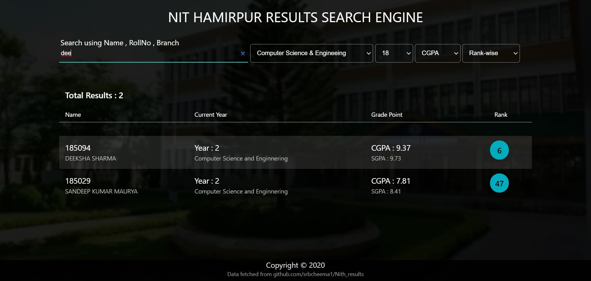

# NITH-Results
This repository contains the results details of all batches(currently studying) in NITH Hamirpur. 
Data fetched by [srbcheema1/Nith_results](https://github.com/srbcheema1/Nith_results) 

### Contributors
1- Tanya Bhandari 
2- Arpita Tiwari

### Screenshots of the project
  

